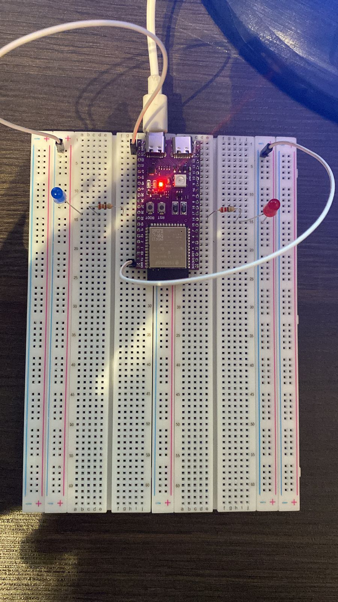

Unificando os autoestudos de Construção de endpoints embarcados e a Revisão com Node.js:

- Crie um Game que permita 2 jogadores interagirem com o ESP32. 
- Os jogadores devem interagir através de um dispositivo(seja celular ou computador) utilizando uma página WEB. 
- O ESP deve acionar algum atuador indicando o final do game, por exemplo, disparando um motor ou acendendo uma lâmpada via relês
- Não há restrição quanto a sensores, KeyPad, LCDs ou o que você deseje criar para seu jogo

# Aluna: Gabriela Rodrigues Matias
# Turma: 5
# Professor Orientador: Egon 

## Código Fonte: 

O código fonte do projeto pode ser acessado na pasta "codigo_fonte" que contem o arquivo: 'hashGame.ino'

## Video de Funcionamento: 

[Vídeo de Funcionamento](https://youtube.com/shorts/JAswyHp9RBE?feature=share) 

## Imagem do Circuito: 

## Link do Simulador: 

[Simulaçao de Funcionamento - Wokwi](https://wokwi.com/projects/350167055882781267)